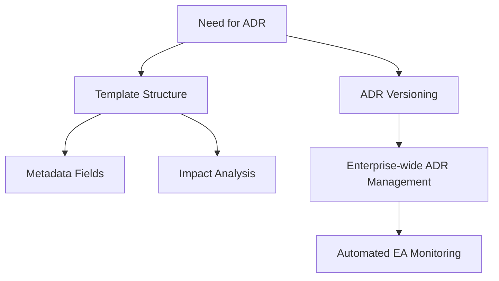

# ADR Overview

## Visual Dependency Graph

This graph represents the dependencies between the ADRs using Mermaid. Each ADR is represented as a node, and dependencies are represented as directed edges between nodes.

## Purpose

The purpose of this graph is to provide a visual representation of how the ADRs are interconnected. It helps in understanding the dependencies and relationships between different ADRs, making it easier to navigate and comprehend the overall architecture decision process.
